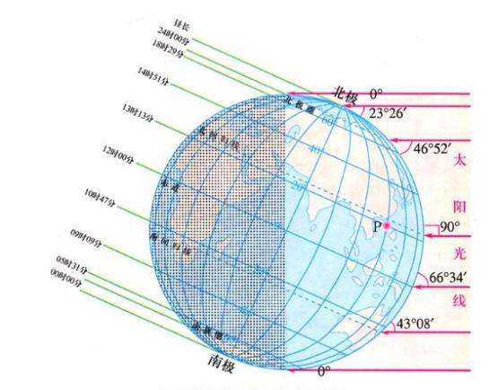

## TIME & DATE

#### GMT(Greenwich Mean Time)
**格林威治标准时间**是以太阳直射本初子午线(0 度经线)作为 12:00 来定时的。
有了标准，全世界的计时就可以统一起来了，只需要知道一个地区的经度，就可以推算出此处的时间。

https://www.timeanddate.com/time/zones/gmt
https://greenwichmeantime.com/what-is-gmt/

#### UTC(Coordinated Universal Time)
**协调统一时间** 是一个 *标准时间*，而不像 GMT 通常是指代一个时区(每 15 度表示一个新的时区)。
它是我们现在看到的**生活时间**的基础

https://www.timeanddate.com/time/aboututc.html
https://www.timeanddate.com/time/gmt-utc-time.html

#### DST(Daylight Saving Time)
**夏令时** 是指夏季的时候将钟表往前调一个小时，秋季的时候再调整回来。

https://www.timeanddate.com/time/dst/

#### Standard-Time

https://www.timeanddate.com/time/standard-time.html

#### IDL
https://www.timeanddate.com/time/dateline.html

